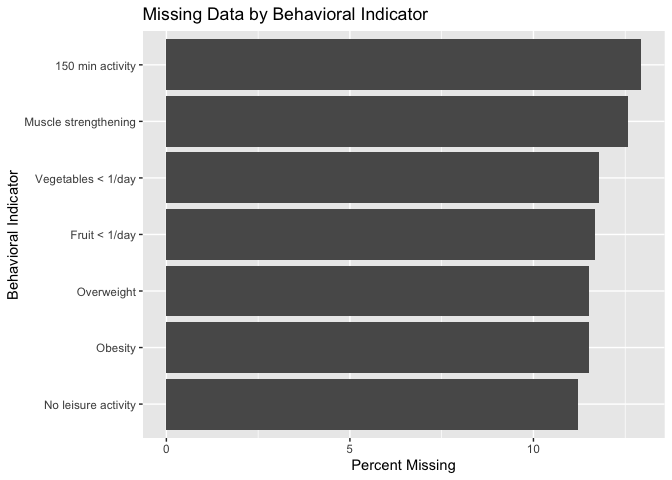

Initial Data Check
================

``` r
df <- read_csv("../data/raw/adult_obesity_behavior.csv", show_col_types = FALSE)
```

``` r
# Identify raw column names
names(df)
```

    ##  [1] "YearStart"                  "YearEnd"                   
    ##  [3] "LocationAbbr"               "LocationDesc"              
    ##  [5] "Datasource"                 "Class"                     
    ##  [7] "Topic"                      "Question"                  
    ##  [9] "Data_Value_Unit"            "Data_Value_Type"           
    ## [11] "Data_Value"                 "Data_Value_Alt"            
    ## [13] "Data_Value_Footnote_Symbol" "Data_Value_Footnote"       
    ## [15] "Low_Confidence_Limit"       "High_Confidence_Limit"     
    ## [17] "Sample_Size"                "Total"                     
    ## [19] "Age(years)"                 "Education"                 
    ## [21] "Sex"                        "Income"                    
    ## [23] "Race/Ethnicity"             "GeoLocation"               
    ## [25] "ClassID"                    "TopicID"                   
    ## [27] "QuestionID"                 "DataValueTypeID"           
    ## [29] "LocationID"                 "StratificationCategory1"   
    ## [31] "Stratification1"            "StratificationCategoryId1" 
    ## [33] "StratificationID1"

``` r
# Inspect variable types and overall data set structure
glimpse(df)
```

    ## Rows: 110,880
    ## Columns: 33
    ## $ YearStart                  <dbl> 2011, 2011, 2011, 2011, 2011, 2011, 2011, 2…
    ## $ YearEnd                    <dbl> 2011, 2011, 2011, 2011, 2011, 2011, 2011, 2…
    ## $ LocationAbbr               <chr> "AL", "AL", "AL", "AL", "AL", "AL", "AL", "…
    ## $ LocationDesc               <chr> "Alabama", "Alabama", "Alabama", "Alabama",…
    ## $ Datasource                 <chr> "Behavioral Risk Factor Surveillance System…
    ## $ Class                      <chr> "Obesity / Weight Status", "Obesity / Weigh…
    ## $ Topic                      <chr> "Obesity / Weight Status", "Obesity / Weigh…
    ## $ Question                   <chr> "Percent of adults aged 18 years and older …
    ## $ Data_Value_Unit            <chr> NA, NA, NA, NA, NA, NA, NA, NA, NA, NA, NA,…
    ## $ Data_Value_Type            <chr> "Value", "Value", "Value", "Value", "Value"…
    ## $ Data_Value                 <dbl> 34.8, 35.8, 32.3, 34.1, 28.8, 16.3, 27.8, 3…
    ## $ Data_Value_Alt             <dbl> 34.8, 35.8, 32.3, 34.1, 28.8, 16.3, 27.8, 3…
    ## $ Data_Value_Footnote_Symbol <chr> NA, NA, NA, NA, NA, NA, NA, NA, NA, NA, NA,…
    ## $ Data_Value_Footnote        <chr> NA, NA, NA, NA, NA, NA, NA, NA, NA, NA, NA,…
    ## $ Low_Confidence_Limit       <dbl> 31.3, 31.1, 28.0, 29.7, 25.4, 12.6, 14.4, 3…
    ## $ High_Confidence_Limit      <dbl> 38.5, 40.8, 36.8, 38.8, 32.5, 20.9, 46.9, 4…
    ## $ Sample_Size                <dbl> 1367, 757, 861, 785, 1125, 356, 58, 598, 86…
    ## $ Total                      <chr> NA, NA, NA, NA, NA, NA, NA, NA, NA, NA, NA,…
    ## $ `Age(years)`               <chr> NA, NA, NA, NA, NA, "18 - 24", NA, "25 - 34…
    ## $ Education                  <chr> NA, NA, NA, NA, NA, NA, NA, NA, NA, NA, NA,…
    ## $ Sex                        <chr> NA, NA, NA, NA, NA, NA, NA, NA, NA, NA, NA,…
    ## $ Income                     <chr> "$15,000 - $24,999", "$25,000 - $34,999", "…
    ## $ `Race/Ethnicity`           <chr> NA, NA, NA, NA, NA, NA, "2 or more races", …
    ## $ GeoLocation                <chr> "(32.840571122, -86.631860762)", "(32.84057…
    ## $ ClassID                    <chr> "OWS", "OWS", "OWS", "OWS", "OWS", "OWS", "…
    ## $ TopicID                    <chr> "OWS1", "OWS1", "OWS1", "OWS1", "OWS1", "OW…
    ## $ QuestionID                 <chr> "Q036", "Q036", "Q036", "Q036", "Q036", "Q0…
    ## $ DataValueTypeID            <chr> "VALUE", "VALUE", "VALUE", "VALUE", "VALUE"…
    ## $ LocationID                 <chr> "01", "01", "01", "01", "01", "01", "01", "…
    ## $ StratificationCategory1    <chr> "Income", "Income", "Income", "Income", "In…
    ## $ Stratification1            <chr> "$15,000 - $24,999", "$25,000 - $34,999", "…
    ## $ StratificationCategoryId1  <chr> "INC", "INC", "INC", "INC", "INC", "AGEYR",…
    ## $ StratificationID1          <chr> "INC1525", "INC2535", "INC3550", "INC5075",…

``` r
# List survey questions included in the raw dataset
df %>% count(Question, sort = TRUE)
```

    ## # A tibble: 9 × 2
    ##   Question                                                                     n
    ##   <chr>                                                                    <int>
    ## 1 Percent of adults aged 18 years and older who have an overweight classi… 21560
    ## 2 Percent of adults aged 18 years and older who have obesity               21560
    ## 3 Percent of adults who engage in no leisure-time physical activity        21560
    ## 4 Percent of adults who achieve at least 150 minutes a week of moderate-i…  9240
    ## 5 Percent of adults who achieve at least 150 minutes a week of moderate-i…  9240
    ## 6 Percent of adults who achieve more than 300 minutes a week of moderate-…  9240
    ## 7 Percent of adults who engage in muscle-strengthening activities on 2 or…  9240
    ## 8 Percent of adults who report consuming fruit less than one time daily     4620
    ## 9 Percent of adults who report consuming vegetables less than one time da…  4620

``` r
# Check year range covered by raw dataset
df %>%
  summarise(
    min_year = min(YearStart),
    max_year = max(YearStart)
  )
```

    ## # A tibble: 1 × 2
    ##   min_year max_year
    ##      <dbl>    <dbl>
    ## 1     2011     2024

``` r
# Check for missing values in each raw-data column
df %>%
  summarise(across(everything(), ~sum(is.na(.)))) %>%
  pivot_longer(everything(),
               names_to = "column",
               values_to = "missing_values") %>%                                  
  arrange(desc(missing_values))
```

    ## # A tibble: 33 × 2
    ##    column                     missing_values
    ##    <chr>                               <int>
    ##  1 Total                              106920
    ##  2 Data_Value_Unit                    106260
    ##  3 Sex                                102960
    ##  4 Data_Value_Footnote_Symbol          97666
    ##  5 Data_Value_Footnote                 97666
    ##  6 Education                           95040
    ##  7 Age(years)                          87120
    ##  8 Income                              83160
    ##  9 Race/Ethnicity                      79200
    ## 10 Data_Value                          13214
    ## # ℹ 23 more rows

``` r
# Visualize missingness across behavioral indicators in the raw dataset
df %>%
  mutate(
    missing = is.na(Data_Value),
    Question_short = case_when(
      Question == "Percent of adults aged 18 years and older who have obesity" ~ "Obesity",
      Question == "Percent of adults aged 18 years and older who have an overweight classification" ~ "Overweight",
      Question == "Percent of adults who engage in no leisure-time physical activity" ~ "No leisure activity",
      Question == "Percent of adults who report consuming fruit less than one time daily" ~ "Fruit < 1/day",
      Question == "Percent of adults who report consuming vegetables less than one time daily" ~ "Vegetables < 1/day",
      Question == "Percent of adults who engage in muscle-strengthening activities on 2 or more days a week" ~ "Muscle strengthening",
      str_detect(Question, "150 minutes") ~ "150 min activity",
      str_detect(Question, "300 minutes") ~ "300 min activity",
      TRUE ~ Question
    )
  ) %>%
  group_by(Question_short) %>%
  summarise(percent_missing = mean(missing) * 100) %>%
  ggplot(aes(x = reorder(Question_short, percent_missing),
             y = percent_missing)) +
  geom_col() +
  coord_flip() +
  labs(
    x = "Behavioral Indicator",
    y = "Percent Missing",
    title = "Missing Data by Behavioral Indicator"
  )
```

<!-- -->

``` r
# Restrict to total-population rows and check for duplicate state-year-question combinations
df_total <- df %>%
  filter(Total == "Total")

df_total %>%
  count(LocationDesc, YearStart, Question) %>%
  filter(n > 1)
```

    ## # A tibble: 0 × 4
    ## # ℹ 4 variables: LocationDesc <chr>, YearStart <dbl>, Question <chr>, n <int>
